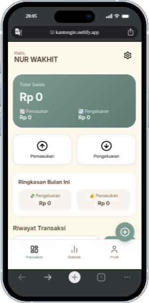

# 💰 Kantongin - Personal Finance Tracker

> Aplikasi tracker keuangan pribadi yang bisa diinstall di HP, bekerja offline, dan sinkron ke cloud.

## 📱 Fitur Utama

- 🔐 **Login dengan Google** - Aman dan mudah
- 💵 **Catat Pemasukan & Pengeluaran** - Lengkap dengan kategori
- 📊 **Grafik Statistik** - Visualisasi pengeluaran per kategori
- 🌙 **Dark Mode** - Nyaman di mata
- 📤 **Export Data ke CSV** - Backup data kapan saja
- ☁️ **Cloud Sync** (Supabase) - Data tetap aman
- 📱 **PWA** - Bisa diinstall ke HP
- ⚡ **Offline Support** - Tetap berfungsi tanpa internet

## 🛠️ Teknologi yang Digunakan

- **Frontend**: HTML5, CSS3, JavaScript (ES6+)
- **Backend/Cloud**: Supabase (Auth & Database)
- **Hosting**: Netlify
- **Grafik**: Chart.js
- **PWA**: Service Worker + Manifest

## 🚀 Live Demo

🔗 **[https://kantongin.netlify.app](https://kantongin.netlify.app)**

## 📸 Screenshots

## 📱 Cara Install ke HP

1. Buka `https://kantongin.netlify.app` di Chrome
2. Klik menu 3 titik → **"Install app"** / **"Add to Home Screen"**
3. Aplikasi akan muncul di home screen HP Anda

## 📁 Struktur Proyek

kantongin/
├── index.html # Halaman utama
├── manifest.json # Konfigurasi PWA
├── sw.js # Service Worker
├── css/
│ └── style.css # Styling
├── js/
│ ├── app.js # Main entry point
│ ├── auth.js # Autentikasi
│ ├── database.js # Database operations
│ ├── ui/ # UI components
│ └── utils/ # Helper functions
├── icons/ # Icon assets
└── public/ # Public assets

## 🤝 Kontribusi

Proyek ini open source! Jika Anda ingin berkontribusi:

1. Fork repository ini
2. Buat branch fitur baru (`git checkout -b feature/AmazingFeature`)
3. Commit perubahan (`git commit -m 'Add some AmazingFeature'`)
4. Push ke branch (`git push origin feature/AmazingFeature`)
5. Buat Pull Request

## 📝 Lisensi

Distributed under the MIT License. See `LICENSE` for more information.

## 👤 Author

**masnur-tech**

- GitHub: [@masnur-tech](https://github.com/masnur-tech)
- Email: nur_wakhit@outlook.com

---

⭐️ Jika Anda menyukai proyek ini, berikan bintang di GitHub!
